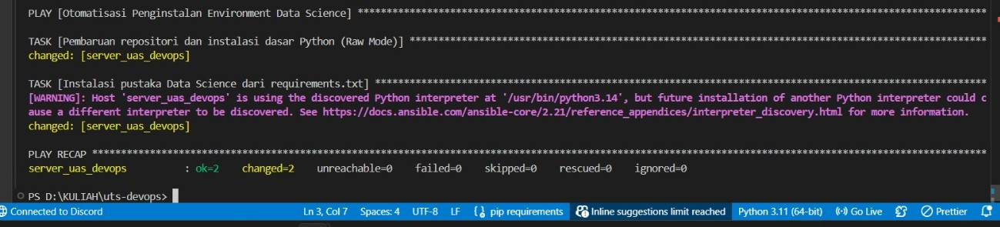

# Analisis Nilai Mahasiswa — UTS DevOps & Data Science

Aplikasi Python sederhana untuk menganalisis nilai mahasiswa dan menyimpan hasilnya ke database PostgreSQL, dikontainerisasi menggunakan Docker dan Docker Compose.

---

## Deskripsi Proyek

Script `uts.py` membaca data nilai 10 mahasiswa, menghitung statistik dasar (rata-rata, nilai tertinggi/terendah, jumlah lulus dan tidak lulus), lalu menyimpan hasilnya ke dalam database PostgreSQL.

---

## Arsitektur Sistem

Base image `python:3.9-slim` dipilih karena ukurannya yang ringan namun sudah cukup untuk menjalankan aplikasi Python beserta library yang dibutuhkan. Proyek ini terdiri dari dua container: `db` (PostgreSQL) dan `app` (Python). Keduanya berada dalam satu jaringan internal Docker, sehingga `app` bisa terhubung ke `db` menggunakan nama host `db`. Container `app` dikonfigurasi dengan `depends_on` agar selalu menunggu `db` siap terlebih dahulu. Data PostgreSQL disimpan menggunakan Docker Volume sehingga tidak hilang saat container dimatikan.

---

## Cara Menjalankan (UTS)

**Prasyarat:** Docker Desktop sudah terinstall dan running.

**1. Clone repositori**
```bash
git clone https://github.com/Runyuk/uts-devops.git
cd uts-devops
```

**2. Jalankan aplikasi**
```bash
docker-compose up --build
```

**3. Matikan aplikasi**
```bash
docker-compose down
```

---

## Panduan UAS — Infrastructure as Code & Automation

Setelah tahap UTS, sistem telah dikembangkan menggunakan **Infrastructure as Code (IaC)** dengan **Terraform** dan **Configuration Management** dengan **Ansible** untuk otomatisasi penyediaan server dan instalasi software.

### Prasyarat
- Docker Desktop terinstall dan running
- Terraform terinstall (versi ~3.0.0)
- Ansible terinstall (atau gunakan Docker image alpine/ansible)

### 1️⃣ Membuat Infrastruktur dengan Terraform

Masuk ke folder terraform:
```bash
cd terraform
```

Inisialisasi Terraform (hanya sekali):
```bash
terraform init
```

Buat container Ubuntu kosong yang akan digunakan:
```bash
terraform apply -auto-approve
```

**Output sukses:**
```
Apply complete! Resources: 1 added, 0 changed, 0 destroyed.
```

Verifikasi container terbuat:
```bash
docker ps
```

Akan menampilkan container `server_uas_analitik` dengan status `Up`.

---

### 2️⃣ Otomatisasi Instalasi Software dengan Ansible

Kembali ke root project:
```bash
cd ..
```

Jalankan playbook Ansible untuk menginstal Python, pip, dan semua dependency:

**Di Windows PowerShell:**
```powershell
docker run --rm -it `
-v /var/run/docker.sock:/var/run/docker.sock `
-v "${PWD}:/ansible" `
-w /ansible `
--entrypoint sh alpine/ansible `
-c "apk add --no-cache docker-cli && ansible-playbook -i ansible/inventory.ini ansible/playbook.yml"
```

**Di Linux/macOS Bash:**
```bash
docker run --rm -it \
-v /var/run/docker.sock:/var/run/docker.sock \
-v "$(pwd):/ansible" \
-w /ansible \
--entrypoint sh alpine/ansible \
-c "apk add --no-cache docker-cli && ansible-playbook -i ansible/inventory.ini ansible/playbook.yml"
```

**Output sukses (PLAY RECAP):**
```
PLAY RECAP

server_uas_analitik : ok=3 changed=2 failed=0
```

Status `failed=0` dengan warna hijau/kuning menandakan semua task berhasil.

---

### 3️⃣ Copy Aplikasi dan Dataset ke Container

Salin script Python ke container:
```bash
docker cp uts.py server_uas_analitik:/uts.py
```

Salin dataset CSV (jika ada):
```bash
docker cp hasil_nilai.csv server_uas_analitik:/hasil_nilai.csv
```

Verifikasi file telah tersalin:
```bash
docker exec -it server_uas_analitik ls /
```

---

### 4️⃣ Menjalankan Aplikasi Analisis Data

Jalankan program Python di dalam container:
```bash
docker exec -it server_uas_analitik python3 /uts.py
```

**Contoh output:**
```
========================================
   ANALISIS NILAI MAHASISWA
========================================
     Nama  Nilai
    Alice     85
      Bob     90
  Charlie     78
    Diana     92
      Eve     65
    Faris     88
     Gita     70
   Hendra     55
    Indra     76
    Julia     95
----------------------------------------
Rata-rata Nilai  : 82.40
Nilai Tertinggi  : 95
Nilai Terendah   : 55
Jumlah Lulus     : 8 mahasiswa
Tidak Lulus      : 2 mahasiswa
========================================
```

---

### 5️⃣ Cleanup & Hapus Infrastruktur

Untuk menghapus semua resource yang dibuat oleh Terraform:

Masuk ke folder terraform:
```bash
cd terraform
```

Hapus infrastruktur:
```bash
terraform destroy -auto-approve
```

**Output sukses:**
```

Destroy complete! Resources: 1 destroyed.
```

---

## 📋 Struktur Proyek UAS

```
uts/
│
├── terraform/
│   └── main.tf              (Definisi infrastruktur Docker)
│
├── ansible/
│   ├── inventory.ini        (Daftar host & konfigurasi koneksi)
│   └── playbook.yml         (Otomatisasi instalasi software)
│
├── uts.py                   (Script analisis data)
├── requirements.txt         (Dependency Python)
├── Dockerfile              (Definisi container aplikasi)
├── docker-compose.yml      (Orkestra Docker untuk UTS)
├── README.md               (Dokumentasi)
└── .github/workflows/      (CI/CD pipeline)
```

---

## 🛠️ Teknologi yang Digunakan (UAS)

| Teknologi | Fungsi |
|-----------|--------|
| Terraform | Infrastructure as Code - provisioning container |
| Ansible | Configuration Management - otomatisasi instalasi |
| Docker | Containerization - isolasi lingkungan |
| Python | Data Science - analisis nilai mahasiswa |
| Pandas | Data Processing - pengolahan dataset |

---

## 🎯 Ringkasan Alur UAS

1. **Terraform** menciptakan container Ubuntu kosong
2. **Ansible** mengotomatisasi instalasi Python, pip, dan library
3. **Docker cp** menyalin aplikasi ke dalam container
4. **Python** menjalankan analisis data
5. **Terraform destroy** membersihkan infrastruktur

---
